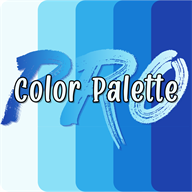

<p align="center">
  
</p>

<h1 align="center">Color Palette PRO</h1>

<p align="center">
  Pick a color, a photo, a mood or a theme, and get beautiful, named color palettes.<br>
  Keep them in a flip-through swatch book or a fan deck, see them on example artwork, print and cut swatch sheets,<br>
  and export to Procreate, Photoshop, Illustrator, Affinity, Canva, GIMP and more. It all works offline.<br>
  By <strong>On the Rise Digital</strong>
</p>

> **Proprietary software.** All rights reserved. The code is not open source and may not be copied, used or
> redistributed. See [LICENSE](LICENSE). © 2026 Alison Risner, trading as On the Rise Digital.

---

## Features

### Five ways to start
| Mode | What it does |
|---|---|
| **Color** | Pick a color with the wheel or brightness slider, type a hex code, pick from the screen (EyeDropper API), or pick from an image |
| **Photo** | Drop, choose or paste a photo. The first palette uses **only colors taken from the photo's own pixels**; the rest are palettes built around its main colors |
| **Theme** | 24 themes (Spring, Halloween, Ocean, Cottagecore, Neon Nights, …) chosen from a dropdown or emoji tiles. No starting color needed |
| **Mood** | Type "rainy café" or "cozy winter" and get palettes for it. Understands words like dark, soft, vivid, warm and vintage |
| **Build** | Make your own palette: add the color on the wheel, paste a list of HEX/RGB codes, or import a palette file (1–30 colors) |

### Palettes
- **Curated, not computed:** each palette is built like a surface designer would build it. A classic harmony (complementary,
  triadic, …) quietly places the first 3–4 colors, each drifted 10–25° off its textbook spot. The rest are new hues, soft
  neutrals (creams, taupes, grays, charcoals) and one or two **wildcard** pops that break the rule on purpose.
  No hue appears in more than two versions, and every palette reaches from very dark to very light and from muted to bright.
- **Lean toward a harmony** (optional): two in every three palettes use it and are labelled; the rest stay a surprise.
  With "Anything goes" (the default) no harmony labels are shown. You choose how many palettes to show (1–40, 14 by default).
- **Size:** 6–15 colors per palette.
- **Variety:** the palettes on your dashboard, and every shuffle, are really different from each other.
- **Mockups:** every palette has a **Show artwork** button that paints it onto example artwork and mockups.
- **Names:** every color gets a cute, unique name and every palette a fitting name. Names can be edited.
- **Codes:** every color shows its **HEX and RGB**; tap either to copy. A palette's copy menu copies all its HEX codes, all its RGB codes, or names with both.
- **Lock colors:** lock the colors you love, then shuffle for new ones. Locked colors stay put.
- **Editing:** swap any color (suggestions or a custom color), remove colors, add colors, or shuffle a single palette.
- **Styles:** paint chips (default), hearts, stars, abstract, messy swatches (large or small), circles, flowers, clouds, paint drops or hexagons.
- **Contrast checker:** WCAG contrast for every pair of colors, and the best text color for each.

### Swatch Book and Swatch Deck
Choose how your saved palettes look. Switch any time; nothing is lost.
- **Book:** a **flipbook** with a cover, 3D page turns and index tabs down the side. Swipe on touch screens, drag with a
  mouse, or use the arrow buttons and ← → keys. Tap the cover to open it.
- **Deck:** a **fan of blades** hanging from a ring. Swipe to fan through them, tap a side blade to bring it forward,
  or scrub with the slider. With a cover, the deck starts closed.
- **Customize** (either one), with a live preview: chip shapes (one or several), show or hide the palette name, color
  names, HEX and RGB, palettes per page or blade (sizes adjust to fit), portrait or landscape pages, and **example
  artwork** pages after each page of palettes.
- **Covers:** your own color or **picture**, and your own title and subtitle (the standard words are "Color Palette PRO"
  and "Swatch Book" or "Swatch Deck"). The deck's cover is optional.
- **Index tabs** to organize palettes by color, season, project or anything else, plus one-tap **Sort by color**.
- **Move palettes:** press and hold (on touch) or drag (with a mouse) to reorder them on a page. Drop one on a tab to move
  it to that section, or hold it at the page edge to turn the page. A **⋯ menu** does the same without dragging.
- **Full-screen viewer:** tap a palette and it grows to fill the screen. It has big color stripes with copyable codes,
  swiping between palettes, and **quick export** buttons.

### Palette in context
See a palette on **example artwork** (mandala, sunset hills, flower vase, geometric art, a website, a room, a patchwork
quilt, a brand board). Tap any shape to repaint it, shuffle the arrangement, try a dark version, or turn it into a
**coloring page**. Save as PNG, PDF or SVG.

### Print and cut
Make a **swatch deck** (blades) or **swatch book** (pages) as **PDF, SVG, PNG or JPG**, on US Letter or A4.
- **Match my supplies:** your palette colors, each with a blank spot beside it (or on the back, printed two-sided) so you can
  swatch your own paint, pencils or markers next to the printed color. **Swatch my supplies:** blank numbered chips for
  labelling what you own, with medium, brand and count. **Palette cards:** just your palettes.
- **Simple or Customize:** squares and rectangles by default; or pick shapes, what to show, palettes per blade or page, a
  punch hole (top left, middle or right, three sizes), and example artwork pages. A live preview shows every change.
- **For cutting machines:** an SVG of the cut lines only (compound shapes with the holes cut out), or a transparent PNG for
  Print Then Cut.

### Share, import, export and back up
- **Share** a palette as a link, a short code or a **QR code**. They carry the palette itself, so there is no server.
- **Import** palette files from other apps (`.ase`, `.aco`, `.gpl`, Procreate `.swatches`, Sketch, hex lists, CSS and more),
  or drop them on the Swatch Book.
- **Back up and restore** your swatch book as a **flipbook page** (`.html`, which keeps the animation and style and works
  with no internet) or a **data file** (`.json`). Restore replaces your book or adds to it.
- **Export:**

| App | Format |
|---|---|
| Procreate | `.swatches` |
| Photoshop, Illustrator, InDesign, Affinity, CorelDRAW | Adobe Swatch Exchange `.ase` |
| Photoshop (classic swatches) | `.aco` |
| GIMP, Krita, Inkscape, Aseprite, Scribus | `.gpl` |
| Sketch | `.sketchpalette` |
| Figma, Canva and vector apps | `.svg` swatch sheet |
| Canva Brand Kit, Coolors, Cricut | hex list `.txt` (also copied to the clipboard) |
| Paint.NET | `.txt` palette |
| Sharing and printing | `.jpg`, or a transparent `.png`, in the swatch style you're viewing |
| Web | CSS custom properties `.css`, `.json` |

On phones and tablets, exports go through the native share sheet.

### Design
- A "liquid glass" interface: frosted panels with a sheen that follows the pointer, and an ambient background that takes its colors from your palettes.
- Accent colors follow your chosen color.
- Springy motion and haptics, a sparkle burst when you save, and paint chips that deal onto the page.
- Light and dark mode, `prefers-reduced-motion` support, keyboard support, and a bottom dock on phones.

### Platform
- An installable **offline PWA**. After the first load it works with no connection at all. No accounts, no tracking, no server.
- **Settings** (the gear) shows that it works offline, what is stored on the device, and offers **Protect my data**, backups,
  **Delete the offline copy** and **Delete all my data**.
- **It cleans up after itself.** Pictures are read in memory and let go, temporary download links are released seconds after
  use, dialogs are removed from the page when closed, and the only things stored are listed in the privacy policy.
- In-app legal pages at `legal.html?doc=…`, stored with the app so they work offline too.

## Quick start

Requires [Node.js](https://nodejs.org) 20+ (for the dev server, tests and build only). The app has no runtime dependencies.

```bash
npm start          # dev server at http://localhost:5173
npm test           # unit tests (also checks the offline file list)
npm run shell      # rewrite the offline file list in sw.js after adding or removing files
npm run build      # write the deployable files to dist/ (public files only)
npm run preview    # serve dist/ to try exactly what will be deployed
```

Open the app from `http://localhost:5173` (a web address, not a `file://` path) so the offline mode can work.

## Deploying

`npm run build` writes everything the site needs to `dist/` (including `sw.js`, which makes it work offline). Upload that
folder to any static host.

- **Vercel:** `vercel.json` already sets the build command (`npm run build`) and the output directory (`dist`), so importing
  the repository just works. It also adds a few safe headers (`nosniff`, no referrer, and a no-cache rule for `sw.js`).
- **Other hosts** (Netlify, Cloudflare Pages, GitHub Pages): set the build command to `npm run build` and the publish
  directory to `dist`.
- Serve it from a web address (https), not as a `file://` path, or the offline mode cannot start.

## Project structure

```
├── index.html              App shell
├── legal.html              Renders the public documents in /Legal
├── manifest.webmanifest    PWA manifest
├── sw.js                   Service worker (network-first, offline fallback; file list generated by `npm run shell`)
├── assets/                 Logo, app icons and the bundled fonts (OFL)
├── src/
│   ├── css/                fonts.css, styles.css (liquid-glass theme), book.css (book and deck), dialogs.css
│   └── js/
│       ├── app.js          Studio: modes, generation, editing, wiring
│       ├── Studio features  mood.js, lock.js, contrast*.js, themes.js, photo.js, picker.js, harmonies.js, names.js, color.js
│       ├── Swatch Book     bookview.js (flipbook + tabs), deckview.js (fan), bookpages.js (page and blade scenes),
│       │                   bookopts.js, cover.js, customizeui.js, viewer.js, book.js (data model)
│       ├── Print and art   sheet.js (layout engine), printable.js, printui.js, scene.js (shared drawing scene),
│       │                   pdf.js, artwork.js, contextui.js, textmetrics.js
│       ├── Share and files sharecode.js, qr.js, shareui.js, importers.js, importui.js, formats.js, export.js, zip.js
│       ├── Backup          backupcore.js, backuphtml.js, backupui.js
│       ├── Offline         pwa.js, settingsui.js, lifecycle.js (cleanup), idb.js, imageutil.js, storage.js, store.js
│       └── ui.js, uikit.js, render.js, shapes.js, exportsheet.js, palettemenu.js, legal.js, meta.js
├── tests/                  Node test runner unit tests
├── scripts/                serve.mjs (dev server and preview), shell.mjs (offline file list), build.mjs (dist/)
├── vercel.json             Vercel build command, output folder and headers
├── docs/                   Roadmap and mobile plan
└── Legal/                  EULA, privacy, terms, storefront and app-store documents, and the font licences
```

## Data and privacy

Everything runs on the device. The swatch book, settings and the palette in progress are stored in `localStorage`
(`cpp.book.v1`, `cpp.prefs.v1`); cover pictures in IndexedDB (`cpp`); and the app's own files in Cache Storage (`cpp-v…`).
Photos and pictures are processed in memory and never uploaded. There's no analytics and no tracking, and the app makes no
third-party requests (the fonts are bundled). See [Legal/shared/PRIVACY-POLICY.md](Legal/shared/PRIVACY-POLICY.md).

## Browser support

The app supports current Chrome, Edge, Safari and Firefox.

- **Pick from screen** needs the [EyeDropper API](https://developer.mozilla.org/docs/Web/API/EyeDropper_API), which only
  Chrome and Edge on desktop support. Other browsers fall back to picking from an image.
- **Share-sheet exports** need the Web Share API with files, which is available on most phones and tablets.
- **Offline use** needs a browser that allows service workers, and the app served from a web address.

## Third-party assets

| Asset | License |
|---|---|
| [Grandstander](https://fonts.google.com/specimen/Grandstander) (bundled) | SIL Open Font License 1.1 |
| [Nunito](https://fonts.google.com/specimen/Nunito) (bundled) | SIL Open Font License 1.1 |

No code libraries are used. App names in the export list are trademarks of their owners. They are used only to describe
compatibility. See [Legal/shared/THIRD-PARTY-LICENCES.md](Legal/shared/THIRD-PARTY-LICENCES.md).

## Roadmap

See [docs/ROADMAP.md](docs/ROADMAP.md) and [docs/MOBILE.md](docs/MOBILE.md).

## Support

Email **ontherisedigital@gmail.com**.
